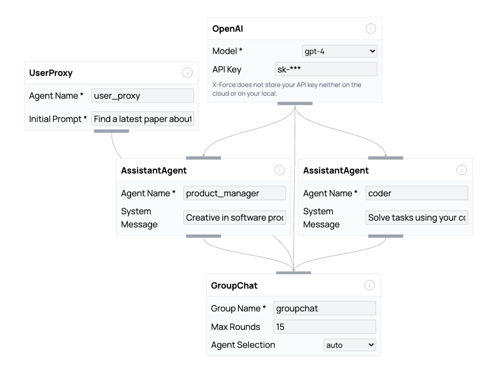

# X-Force IDE

### Create your own workforce @ [ide.x-force.ai](https://ide.x-force.ai)

## What is X-Force IDE?

X-Force IDE is a low-code, agent-as-a-service UI framework that enables you to create agent-based workforces through a drag-and-drop interface. You can export the workforces you create as Python scripts and run them on your local machine.

## Guides

[Getting Started Guide](https://x-force.notion.site/Introduction-to-X-Force-IDE-b92c434802de4df6a58c83fd5d292c33)

[Examples](https://x-force.notion.site/Example-Workforces-fff4a8ee317c4e76b226fef321c098ba)

## Contributing

This project welcomes contributions and suggestions. You can open pull request/issue!
